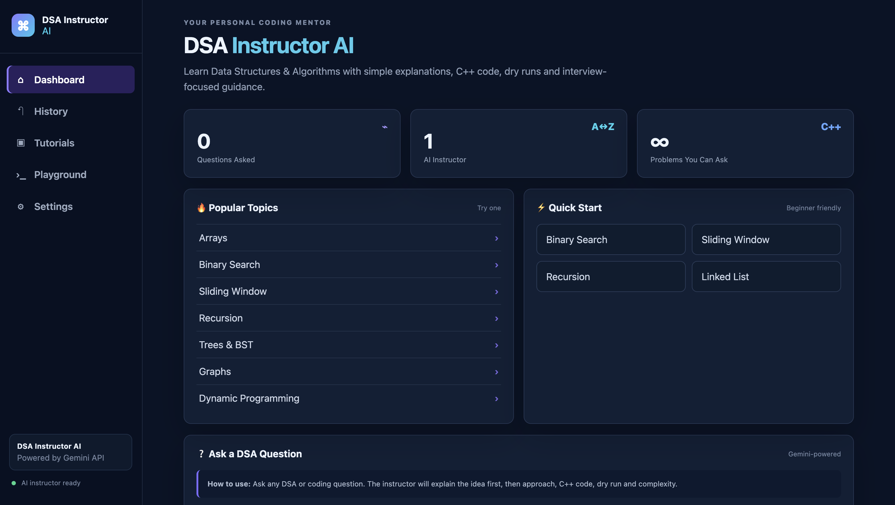
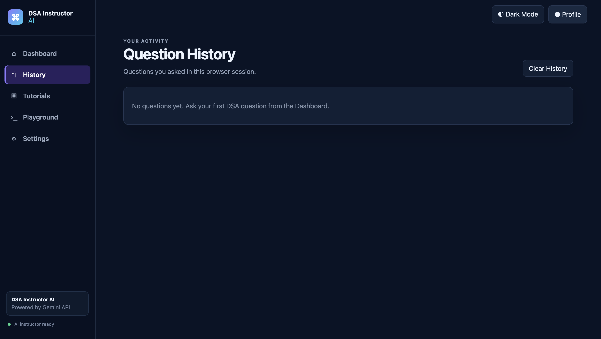
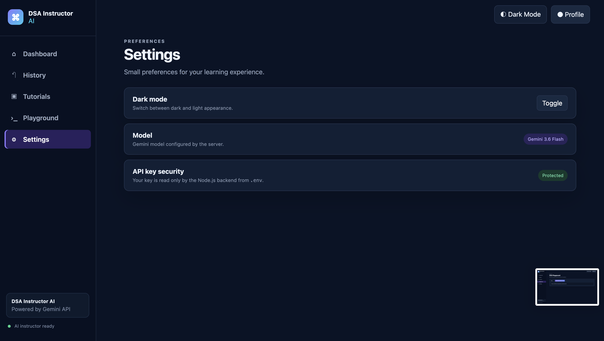
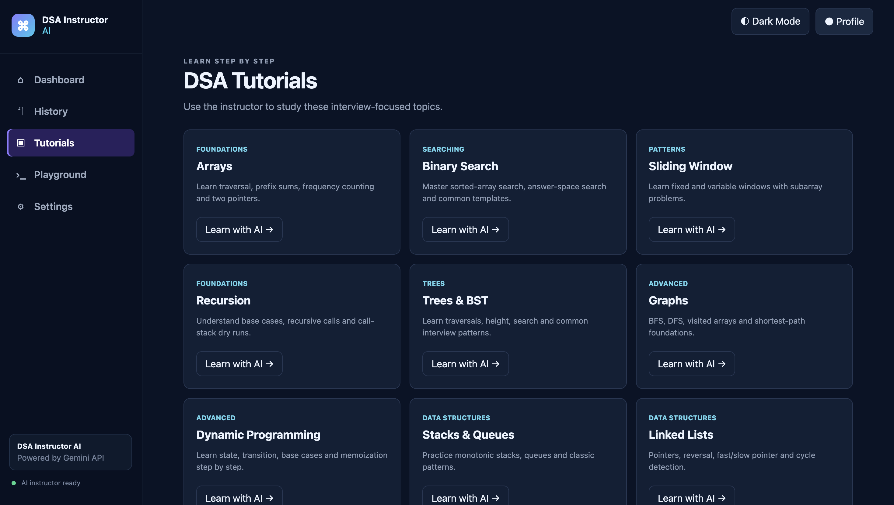
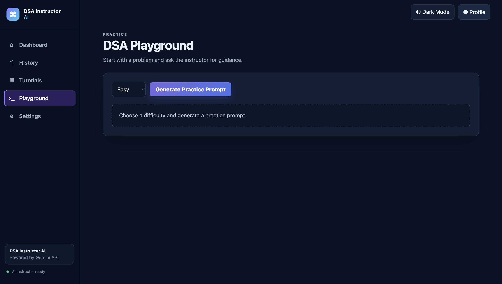

# 🧠 DSA Instructor AI

An AI-powered DSA learning assistant that helps students understand Data Structures and Algorithms through explanations, examples, tutorials, problem-solving guidance, and an interactive coding playground.

🔗 **Live Demo:** https://dsa-instructor-ai-l45d.onrender.com

---

## ✨ Features

* 🤖 **AI-Powered DSA Instructor**
  Ask DSA-related questions and get AI-generated explanations.

* 📚 **Tutorials**
  Learn important DSA concepts in a structured and beginner-friendly way.

* 🧩 **Problem Solving**
  Get explanations, approaches, and guidance for DSA problems.

* 💻 **Code Playground**
  Practice and experiment with code in an interactive environment.

* 🕘 **History**
  View previous questions and interactions.

* ⚙️ **Settings**
  Manage application preferences.

* 📱 **Responsive Interface**
  Clean and user-friendly interface for learning and practice.

---

## 📸 Screenshots

### 🏠 Dashboard



### 📚 History



### ⚙️ Settings



### 🎓 Tutorials



### 💻 Playground



---

## 🏗️ System Architecture

```text
┌───────────────────┐
│       User        │
└─────────┬─────────┘
          │
          ▼
┌───────────────────┐
│   Frontend UI     │
│   HTML/CSS/JS     │
└─────────┬─────────┘
          │
          ▼
┌───────────────────┐
│  Express.js API   │
│     Backend       │
└─────────┬─────────┘
          │
          ▼
┌───────────────────┐
│    Gemini API     │
│   AI Processing   │
└─────────┬─────────┘
          │
          ▼
┌───────────────────┐
│   AI Response     │
└─────────┬─────────┘
          │
          ▼
┌───────────────────┐
│   Frontend UI     │
└───────────────────┘
```

---

## 🛠️ Tech Stack

### Frontend

* HTML5
* CSS3
* JavaScript

### Backend

* Node.js
* Express.js

### AI

* Google Gemini API
* Gemini 3.6 Flash
* `@google/genai`

### Development & Deployment

* Git
* GitHub
* Render

---

## 📂 Project Structure

```text
DSA-Instructor-AI/
│
├── assets/
│   └── screenshots/
│       ├── dashboard.png
│       ├── history.png
│       ├── settings.png
│       ├── tutorials.png
│       └── playground.png
│
├── public/
│   └── ...frontend files
│
├── src/
│   └── ...source files
│
├── test/
│   └── ...test files
│
├── server.js
├── package.json
├── package-lock.json
├── .env.example
├── .gitignore
└── README.md
```

---

## 🚀 Getting Started

### 1. Clone the Repository

```bash
git clone https://github.com/monika-singh-baghel/dsa-instructor-ai.git
```

### 2. Navigate to the Project

```bash
cd dsa-instructor-ai
```

### 3. Install Dependencies

```bash
npm install
```

### 4. Configure Environment Variables

Create a `.env` file in the project root:

```env
GEMINI_API_KEY=your_gemini_api_key
GEMINI_MODEL=gemini-3.6-flash
```

### 5. Start the Application

```bash
npm start
```

The application will run locally through the configured Express server.

---

## 🔐 Environment Variables

| Variable         | Description                          |
| ---------------- | ------------------------------------ |
| `GEMINI_API_KEY` | API key used to access Google Gemini |
| `GEMINI_MODEL`   | Gemini model used by the application |

---

## 🌐 Deployment

The application is deployed using **Render**.

### Deployment Configuration

```text
Platform: Render
Service Type: Web Service
Environment: Node
Branch: main
Build Command: npm install
Start Command: npm start
```

### Live Application

**https://dsa-instructor-ai-l45d.onrender.com**

> The first request may take a little longer if the free Render instance has been inactive.

---

## 🧠 How It Works

1. The user enters a DSA-related question.
2. The frontend sends the request to the Express.js backend.
3. The backend processes the request.
4. The Gemini API generates an AI-powered response.
5. The response is returned to the frontend.
6. The user receives an explanation or solution through the interface.

---

## 🎯 Project Objective

The main objective of **DSA Instructor AI** is to make DSA learning more interactive and accessible by combining traditional programming practice with AI-powered assistance.

The application is designed to help students:

* Understand DSA concepts
* Learn problem-solving approaches
* Practice programming
* Explore tutorials
* Review previous interactions
* Experiment with code

---

## 🔮 Future Improvements

* 🔹 User authentication and personalized profiles
* 🔹 Progress tracking
* 🔹 Topic-wise learning paths
* 🔹 Difficulty-based problem recommendations
* 🔹 More programming language support
* 🔹 Automated code evaluation
* 🔹 Personalized learning recommendations
* 🔹 Improved test coverage
* 🔹 Database integration for persistent user history

---

## 📌 Key Highlights

* AI-powered learning assistant
* Full-stack web application
* REST API based backend
* Google Gemini API integration
* Responsive frontend
* Interactive coding playground
* Deployed cloud application
* GitHub version control

---

## 👩‍💻 Author

### Monika Singh


